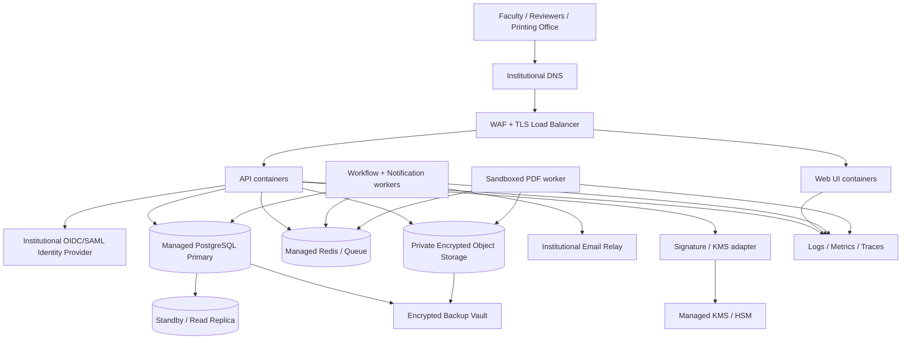

# Deployment and Production-Readiness Guide

## 1. Important Deployment Status

The repository currently contains a system architecture and requirements specification. It does **not** yet contain runnable application source code, container definitions, database migrations, infrastructure-as-code modules, or release artifacts. Therefore, running `docker compose up`, deploying this repository to a web host, or exposing it through a web server will not produce the TOS/TQ system.

Deployment has two distinct parts:

1. **Build the application** described in the system requirements specification.
2. **Provision and operate the production platform** described in this guide.

The following plan is an implementation-ready deployment blueprint. Commands are representative interfaces that the development team should make real as application and infrastructure code are added.

---

## 2. Recommended Production Topology

Start with a containerized modular monolith and independently scalable workers. This is simpler to transact, audit, and operate than an initial microservice estate while preserving clear module boundaries.



### 2.1 Minimum platform components

| Component | Production requirement |
|---|---|
| DNS and TLS | Institution-controlled hostname such as `exam-workflow.example.edu`; TLS 1.2+ certificate with automated renewal. |
| WAF/load balancer | Request-size limits, rate limits, security headers, health probes, and no caching of confidential responses. |
| Web application | Static UI or server-rendered frontend served from versioned, immutable containers. |
| Application API | At least two replicas in production, stateless sessions or a shared secure session store, readiness/liveness probes. |
| Background worker | Transactional-outbox, workflow, email, reminder, malware-scan, and artifact jobs with idempotent retry. |
| PDF renderer | Isolated container without arbitrary internet access; CPU/memory/time limits and an allowlisted font/template bundle. |
| PostgreSQL | Supported managed release, encrypted storage, high availability, point-in-time recovery, private network access. |
| Redis/queue | Private endpoint, authentication/TLS, persistence appropriate to the queue implementation; PostgreSQL remains the source of truth. |
| Object storage | Private, encrypted, object versioning/retention, malware-scanned upload quarantine, short-lived download URLs. |
| Identity provider | Institutional SSO plus MFA/step-up authentication claims for signing and sensitive downloads. |
| KMS/HSM | Non-exportable keys for signature-evidence integrity and secrets encryption; rotation and access logging. |
| Email | Authenticated institutional relay/provider; email contains links and metadata, never exam questions or answer keys. |
| Observability | Central logs, metrics, traces, alerting, audit-stream health monitoring, and correlation IDs. |
| Backup vault | Separate account/project or security boundary, immutable retention where supported, documented restore procedure. |

Equivalent managed services may be selected from AWS, Azure, Google Cloud, a government cloud, or an institutional data center. Select the region and services only after privacy, residency, procurement, and records-management review.

---

## 3. Environment Strategy

Maintain isolated cloud accounts/projects, networks, databases, object buckets, keys, identity clients, and secrets for each environment.

| Environment | Purpose | Data policy | Deployment control |
|---|---|---|---|
| Local | Developer feedback | Generated data only | Developer-managed containers. |
| Development | Integration and demonstrations | Synthetic data only | Automatic from main/integration branch. |
| Test/QA | Functional, accessibility, security, and load tests | Synthetic or irreversibly anonymized | Promoted signed image; QA approval. |
| Staging | Production-equivalent release rehearsal and UAT | Synthetic by default; specifically approved masked data only | Same pipeline and topology as production. |
| Production | Live examination workflow | Classified institutional records | Change approval, separation of duties, controlled rollout. |

Never clone live examinations or signature evidence into lower environments. Non-production email must be captured by a test sink or strict recipient allowlist.

---

## 4. Implementation Artifacts Required Before Deployment

The development team must add and maintain:

```text
apps/
  web/                    # Faculty/reviewer/printing-office UI
  api/                    # API and authorization/workflow modules
  worker/                 # Outbox, email, reminder and artifact workers
  pdf-renderer/           # Sandboxed deterministic document renderer
db/
  migrations/             # Forward-only, reviewed schema migrations
  seeds/                  # Non-sensitive reference/configuration data
deploy/
  docker/                 # Reproducible multi-stage container builds
  compose/                # Local-only dependency stack
  helm/ or manifests/     # Kubernetes release definitions, if selected
infra/
  modules/                # Reusable network/database/storage/KMS modules
  environments/           # Environment-specific IaC composition
scripts/
  verify-release          # Automated pre/post-deployment verification
  backup-restore-test     # Restore rehearsal automation
```

Every release must produce:

- immutable web, API, worker, and renderer images pinned by digest;
- a software bill of materials (SBOM) and provenance/attestation;
- signed artifacts and vulnerability-scan reports;
- ordered database migrations with rollback/forward-recovery instructions;
- versioned TOS, reproduction-form, email, and approval-statement templates;
- release notes, configuration change list, known risks, and operator runbook updates; and
- an automated smoke-test report.

---

## 5. Step-by-Step Deployment Procedure

### Step 1 — Complete institutional decisions

Before writing production infrastructure, obtain written decisions for:

1. Hosting jurisdiction and data residency.
2. Privacy classification of exams, answer keys, signature evidence, IP addresses, and audit records.
3. Required signature standard: authenticated institutional approval, certificate-backed signature, or qualified signature provider.
4. Retention, legal hold, backup, disposal, and audit-access rules.
5. Faculty/coordinator/dean separation-of-duty exceptions.
6. Printing Office access, maximum download/reprint rules, and emergency printing.
7. Recovery objectives, availability objective, peak examination-week load, and maintenance windows.
8. Supported identity, SIS/course-directory, email, timestamp, and KMS integrations.

These are deployment blockers because they determine architecture, configuration, and legal evidence.

### Step 2 — Establish cloud/project and network foundations

Using reviewed infrastructure as code:

1. Create separate development, test, staging, and production accounts/projects/subscriptions.
2. Create private application, data, and management network segments across at least two availability zones where available.
3. Permit inbound internet traffic only to the WAF/load balancer. Databases, queues, KMS endpoints, workers, and storage remain private.
4. Use controlled egress or an allowlist. The PDF renderer should have no general outbound internet access.
5. Create deployment and runtime identities separately; runtime identities receive only their component-specific permissions.
6. Enable provider control-plane, network-flow, KMS, storage, and administrator audit logging before application data is introduced.

The future infrastructure repository should expose an interface similar to:

```bash
# Example interface only; these files do not exist yet.
cd infra/environments/staging
terraform init
terraform fmt -check -recursive
terraform validate
terraform plan -out=deployment.plan
terraform apply deployment.plan
```

Production `apply` must require a reviewed saved plan and a human approval distinct from the plan author.

### Step 3 — Provision stateful services

1. Provision highly available PostgreSQL with private connectivity, TLS, encryption, automatic backups, point-in-time recovery, slow-query monitoring, and a deletion lock.
2. Provision Redis/queue with private connectivity and authentication. Do not use it as the authoritative workflow database.
3. Create separate private object-storage locations for upload quarantine, approved artifacts, and audit exports. Enable encryption, versioning, lifecycle rules, and public-access blocking.
4. Create KMS/HSM keys for application encryption and signature-evidence integrity. Separate key-administrator and key-user roles.
5. Configure backup replication/vault and prove restoration before go-live.

Do not place database passwords, identity secrets, signing keys, or SMTP credentials in Git, images, deployment manifests, or frontend environment files.

### Step 4 — Configure identity and institutional integrations

1. Register distinct OIDC/SAML clients for each environment and exact redirect/logout URIs.
2. Map immutable IdP subject identifiers, not editable display names or email addresses, to users.
3. Require MFA claims for coordinator, dean, printing, administrative, signing, and controlled-download actions.
4. Configure short-lived signing intents and step-up freshness thresholds.
5. Configure SIS/course-directory service credentials as read-only and scope them to required subjects, sections, enrollments, and organizational assignments.
6. Configure the email sender domain, DKIM/SPF/DMARC as applicable, bounce handling, and non-production recipient restrictions.
7. Validate clock synchronization across IdP, application, database, KMS, and optional timestamp authority.

### Step 5 — Create configuration and secrets

Use a managed secret store with workload identity. Recommended logical configuration variables are:

```text
APP_ENV
PUBLIC_BASE_URL
DATABASE_URL                         # Secret reference, never a committed value
QUEUE_URL                            # Secret reference
OBJECT_QUARANTINE_BUCKET
OBJECT_ARTIFACT_BUCKET
OBJECT_AUDIT_BUCKET
OIDC_ISSUER
OIDC_CLIENT_ID
OIDC_CLIENT_SECRET                   # Secret reference
OIDC_REQUIRED_MFA_ACR
KMS_SIGNING_KEY_ID
SMTP_HOST
SMTP_CREDENTIAL                     # Secret reference
SIS_BASE_URL
SIS_CREDENTIAL                      # Secret reference
SESSION_IDLE_MINUTES
SIGNING_AUTH_MAX_AGE_SECONDS
DOWNLOAD_URL_TTL_SECONDS
AUDIT_RETENTION_POLICY_ID
DEFAULT_TIMEZONE
```

Validate configuration at application startup and fail closed when identity, audit, signature, storage, or print-gate dependencies are unavailable. Keep non-secret configuration versioned and promote the same reviewed values through environments with explicit environment overrides.

### Step 6 — Build, scan, sign, and publish images

The CI pipeline must:

1. Check formatting, linting, types, tests, migrations, and generated API contracts.
2. Run dependency, secret, license, source, container, and infrastructure scans.
3. Build reproducibly from pinned dependencies using non-root, minimal runtime images.
4. Generate an SBOM and provenance statement.
5. Sign image digests and push them to a private registry.
6. Reject critical/high exploitable vulnerabilities unless a time-bound, approved exception exists.

Representative future commands:

```bash
# Example interface only; implement these targets in the application repository.
make verify
make test-integration
make test-authorization
make test-pdf-golden
make build-images RELEASE="$RELEASE_SHA"
make scan-images RELEASE="$RELEASE_SHA"
make sign-images RELEASE="$RELEASE_SHA"
```

Deploy by immutable digest, never by a mutable tag such as `latest`.

### Step 7 — Deploy schema migrations safely

1. Back up and record database recovery position.
2. Run migration compatibility checks against the currently deployed version.
3. Use expand/migrate/contract changes so old and new application versions can coexist during rollout.
4. Execute migrations once through a dedicated identity and job; application replicas must not race migrations at startup.
5. Verify constraints for immutable submitted versions, signature/version binding, dean-after-coordinator approval, valid state transitions, and print eligibility.
6. Defer destructive contract migrations until the prior release can no longer be rolled back.

Representative future command:

```bash
./scripts/migrate --environment staging --release "$RELEASE_SHA"
./scripts/verify-migration --environment staging --release "$RELEASE_SHA"
```

Never use destructive automatic schema synchronization in production.

### Step 8 — Deploy application workloads

Recommended release order:

1. database expansion migrations;
2. worker code capable of processing both old and new outbox payload versions;
3. API canary;
4. web application;
5. PDF renderer;
6. full API/worker rollout after canary health passes; and
7. optional contract migration in a later release.

Every workload must define:

- immutable image digest;
- non-root/read-only filesystem controls;
- CPU/memory requests and limits;
- readiness, liveness, and startup probes;
- graceful shutdown and job-drain behavior;
- workload identity and least-privilege service account;
- network policy;
- autoscaling bounds; and
- disruption budget or equivalent availability policy.

Use blue/green or canary delivery. Initially direct only internal pilot users to the canary. Automatically halt on increased error rate, latency, authorization denial anomalies, queue failures, audit-write failures, or artifact-generation failures.

### Step 9 — Load reference data without granting hidden access

1. Import colleges, programs, subjects, terms, sections, templates, and effective-dated reviewer assignments.
2. Reconcile imported users against immutable IdP subject identifiers.
3. Preview and approve role/scope changes with a second administrator.
4. Detect missing, overlapping, ambiguous, or self-approval reviewer assignments.
5. Verify that system administrators cannot read examination content by default.
6. Record import file hash, operator, approver, result, and row-level error report.

Use synthetic packages to test routing. Do not introduce a live examination until scope tests pass.

### Step 10 — Run post-deployment smoke and security checks

Execute these checks against staging and again against the production canary:

1. SSO login/logout, timeout, MFA/step-up, and disabled-user rejection.
2. Faculty creates a TOS/TQ draft, autosaves, maps items, and submits.
3. Invalid TOS/TQ counts block submission.
4. The assigned coordinator can review; another coordinator cannot view the package.
5. Coordinator return and email notification work without exam content in email.
6. Coordinator approval binds the current version hash and routes to the correct dean.
7. Dean approval is impossible without matching coordinator approval.
8. The print API returns `409` before all required signatures/details and `403` for an unauthorized user.
9. An approved package generates a clean PDF with no comments, controls, or unintended answer key.
10. Only the assigned Printing Office can download it; download/reprint is audited.
11. A post-signature content change invalidates print eligibility and requires reapproval.
12. Outbox retry does not duplicate tasks, decisions, signatures, email, or PDFs.
13. Metrics, logs, traces, correlation IDs, alerts, and append-only audit events arrive centrally.
14. Backup restoration and artifact/hash validation succeed in an isolated recovery environment.

If any signature, authorization, audit, print-gate, or confidentiality test fails, do not proceed to production traffic.

### Step 11 — Production go-live

1. Approve the release record, risk assessment, restoration evidence, penetration/accessibility results, and rollback decision tree.
2. Announce the maintenance/change window and support route.
3. Take a final recovery point and verify audit/alert pipelines.
4. Deploy a canary to the pilot college/program.
5. Observe at least one complete synthetic workflow and validate the PDF hash and audit chain.
6. Expand gradually by college or percentage while monitoring service, security, and business metrics.
7. Freeze deployment if exam week is imminent unless the change is explicitly approved as necessary.
8. Complete a go-live review and retain deployment evidence under the change record.

### Step 12 — Rollback or forward recovery

Rollback is permitted only while database and event payloads remain backward compatible. Roll back application images by digest, pause new PDF/signature jobs if needed, and continue preserving audit events.

Prefer forward recovery after a migration or after any new signature evidence has been recorded. Never restore the production database over newer approval/audit records merely to roll back an application release. If integrity or confidentiality may be affected:

1. disable signing, artifact generation, and downloads using a tested feature gate;
2. preserve logs, objects, database state, and correlation IDs;
3. activate the incident-response process;
4. identify affected versions/artifacts and revoke them;
5. notify academic/security owners; and
6. resume only after evidence reconciliation and authorization checks pass.

---

## 6. CI/CD Promotion Gates

| Gate | Development | Test/QA | Staging | Production |
|---|---:|---:|---:|---:|
| Unit/type/lint checks | Required | Required | Required | Inherited signed result |
| Migration tests | Required | Required | Production-like | Reviewed plan required |
| Authorization matrix | Required | Required | Required | Smoke subset required |
| PDF golden/no-comment checks | Required | Required | Required | Smoke subset required |
| SAST/dependency/container/IaC scans | Required | Required | Required | No unresolved blocking finding |
| Accessibility | Automated | Manual + automated | UAT confirmation | Inherited result |
| Load/soak | Optional | Required before release | Production-like | Not run destructively |
| Backup restoration | Periodic | Release candidate | Required before first launch | Scheduled exercise |
| Approval | Developer review | QA | Product/UAT/Security | Change authority + operations |

CI systems may build artifacts; only the deployment system may promote already signed digests. Production runtime credentials must never be available to pull-request jobs.

---

## 7. Health Checks, Monitoring, and Alerts

### 7.1 Health endpoints

- `/health/live`: process is running; must not expose dependency or version secrets.
- `/health/ready`: instance can accept traffic and mandatory dependencies are usable.
- `/health/startup`: migrations/configuration are compatible and templates are loaded.

Audit unavailability must fail closed for signing, approval, artifact generation, download, and printing operations. Email unavailability may degrade asynchronously because the dashboard remains authoritative.

### 7.2 Required dashboards

- HTTP throughput, p50/p95/p99 latency, errors, saturation, and instance health;
- PostgreSQL connections, replication/backup status, locks, storage, and slow queries;
- queue depth/age, retry/dead-letter rates, outbox lag, and worker health;
- PDF duration/failure, page-count anomalies, malware quarantine, and object errors;
- SSO/signing failure, access denials, scoped download/reprint volume, and break-glass use;
- packages by state, reviewer task aging, SLA breaches, routing gaps, and notification failures; and
- audit ingestion latency/gaps and KMS/signature validation failures.

Dashboards and alerts must use package identifiers and metadata, never question stems or answer keys.

### 7.3 Page-worthy alerts

- audit write/ingestion failure;
- authorization or print-gate regression signal;
- KMS/signature validation failure;
- database unavailable, replication failure, or backup missed;
- sustained API error/latency breach;
- outbox/PDF queue age above the examination-period threshold;
- public-access policy change on confidential storage; and
- anomalous mass downloads, repeated reprints, or break-glass access.

---

## 8. Capacity and Availability Baseline

Use measured institutional enrollment and calendar data, not arbitrary instance counts. Before launch, document:

- peak simultaneous authors and reviewers;
- packages and questions per examination period;
- maximum attachment and generated-PDF sizes;
- burst submissions immediately before deadlines;
- concurrent Printing Office downloads;
- notification burst size; and
- retention-driven database and object-storage growth.

Load test at twice forecast peak concurrency and the forecast deadline burst. Begin with at least two API replicas and two worker replicas across failure domains in production, then size from measurements. Keep PDF concurrency bounded so rendering cannot exhaust API or database resources.

The specification proposes an initial 99.9% monthly availability objective, RPO of 15 minutes or less, and RTO of 4 hours or less. Stakeholders must formally approve or revise these targets before infrastructure procurement.

---

## 9. Backup, Restoration, and Disaster Recovery

### 9.1 Backup scope

Back up PostgreSQL, approved artifacts, signature evidence, templates/configuration, audit evidence, and the mapping between database artifact records and object versions. Container images and infrastructure definitions should be reproducible but must remain available in protected registries/repositories.

### 9.2 Restore validation

At least quarterly and before initial launch:

1. Restore the database to an isolated network at a selected point in time.
2. Restore or reconnect copied object versions without making them publicly accessible.
3. Reconcile database artifact hashes against restored objects.
4. Validate signature evidence and the workflow/audit sequence for sampled packages.
5. Confirm application startup, authentication using a recovery IdP configuration, and authorized artifact access.
6. Record actual RPO/RTO, gaps, operator actions, and corrective work.

A database-only restore is insufficient if PDFs, evidence objects, keys, or audit records cannot be reconciled.

---

## 10. Production Readiness Checklist

### Governance and compliance

- [ ] Data classification, privacy impact assessment, threat model, and retention schedule approved.
- [ ] Signature standard and approval statement approved by academic/legal authorities.
- [ ] Hosting region, subprocessors, residency, and institutional procurement approved.
- [ ] Incident response, breach notification, legal hold, and emergency printing procedures tested.

### Application and security

- [ ] All critical acceptance scenarios in the system specification pass.
- [ ] RBAC and organizational-scope matrix tested for positive and negative cases.
- [ ] Print gate is server enforced and fails closed.
- [ ] Submitted versions, signatures, decisions, and audit evidence are immutable.
- [ ] Independent penetration test and accessibility evaluation have no unresolved launch blockers.
- [ ] SBOM, provenance, image signatures, secret scan, and vulnerability results retained.

### Platform and operations

- [ ] Production uses private data services, least-privilege workload identities, TLS, encryption, and managed secrets.
- [ ] High availability, scaling limits, health probes, disruption controls, and controlled egress configured.
- [ ] Monitoring, security alerts, audit-gap detection, on-call ownership, and status communications tested.
- [ ] Point-in-time recovery and complete database/object/evidence restoration demonstrated within approved RPO/RTO.
- [ ] Rollback/forward-recovery and feature gates tested.
- [ ] Runbooks, support escalation, training, and examination-week change policy approved.

### Integrations and data

- [ ] Production SSO/MFA/step-up, SIS, email, KMS, storage, and time synchronization verified.
- [ ] Reviewer assignments have no missing/ambiguous/self-approval routes.
- [ ] Templates and reference data are versioned and approved.
- [ ] Non-production environments cannot email real users or access production records.

Do not launch until all unchecked items have a named risk owner, written exception, expiry date, and compensating control—and never waive a signature, authorization, audit-integrity, or print-gate blocker.

---

## 11. Practical Next Action

The immediate next deliverable should be a thin, deployable vertical slice rather than production infrastructure for an unimplemented system. Build one flow end to end:

1. institutional or test OIDC login;
2. create a package and a small TOS/TQ;
3. submit an immutable version;
4. coordinator approval bound to its content hash;
5. dean approval bound to the same hash;
6. server-enforced print gate;
7. clean PDF plus reproduction request; and
8. audit timeline.

Package it with local container orchestration, migrations, seeded synthetic roles, and automated authorization/print-gate tests. Deploy that slice to the development environment first. It will validate the highest-risk architecture decisions before the institution invests in full production rollout.
