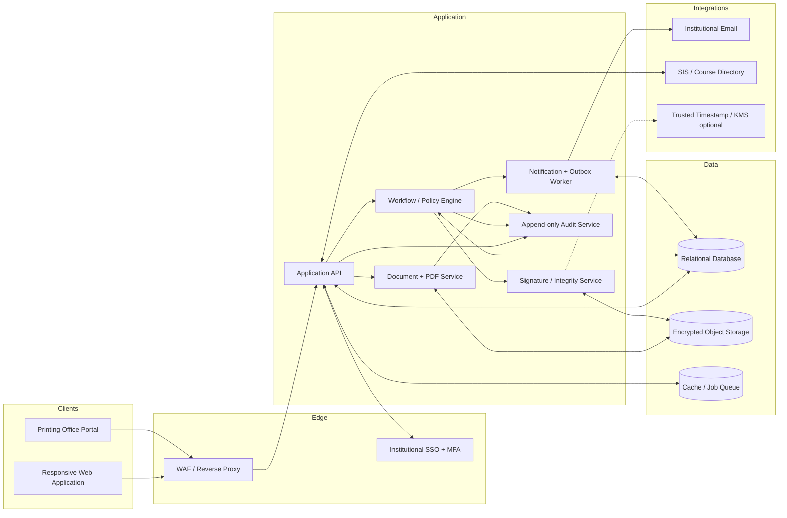
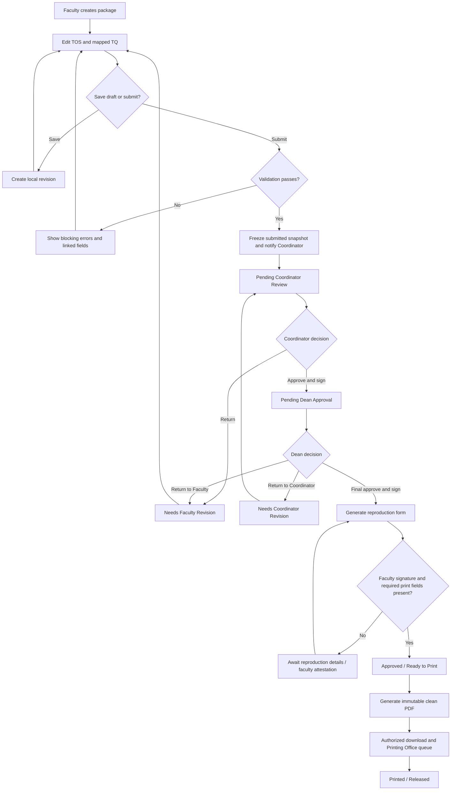

# TOS, TQ, and Examination Printing Request System

## System Architecture and Requirements Specification

**Document status:** Implementation baseline

**Intended audience:** Academic leadership, faculty representatives, registrars, printing-office personnel, information security, developers, QA, and operations teams

**System purpose:** Securely author, review, approve, reproduce, and audit examination packages consisting of a Table of Specifications (TOS), Test Questionnaire (TQ), and Exam Reproduction Request Form.

---

## 1. Scope, Objectives, and Success Criteria

### 1.1 Objectives

The system shall:

1. Give faculty a guided workspace for building a mathematically valid TOS and a TQ whose item numbers are mapped to the TOS.
2. Preserve drafts and an immutable history of submitted versions.
3. Route each submitted package through Program Coordinator and College Dean review.
4. Support item-level annotations, disposition of comments, returns for revision, and attributable digital approvals.
5. Generate an official reproduction request and clean, print-ready PDF only after required approvals.
6. Enforce least privilege, examination confidentiality, separation of duties, and a complete audit trail.
7. Notify participants and provide an accessible, real-time status dashboard.

### 1.2 In scope

- TOS and TQ authoring, validation, versioning, review, approval, signature, PDF export, notifications, dashboards, printing-office receipt, and audit/reporting.
- Configuration of terms, colleges, programs, subjects, sections, reviewer assignments, templates, approval policies, and retention rules.
- Integration with institutional identity, email, directory, and optional student-information/course systems.

### 1.3 Out of scope for the initial release

- Student delivery of the exam, online testing, grading, item analysis after administration, and printing-device control.
- A public-key qualified electronic-signature service unless required by institutional policy. The baseline is an authenticated institutional digital approval with integrity evidence; see section 11.

### 1.4 Measurable success criteria

- No printable exam package can be generated without the configured coordinator and dean approvals.
- TOS item count, TQ item count, item numbering, and mappings agree before submission.
- Every submission, annotation, return, signature, export, download, and print-office acknowledgement is attributable and timestamped.
- Authorized users can determine the current owner, state, due date, and outstanding actions without email.
- A clean export contains no review annotations or draft-only material.

---

## 2. Roles and Responsibilities

| Role | Primary responsibilities |
|---|---|
| Faculty / Instructor | Create TOS and TQ, resolve feedback, attest authorship, submit, complete reproduction details, and download an approved package if policy permits. |
| Program Coordinator | Validate content and alignment, annotate, return or approve and forward, and digitally sign coordinator approval. |
| College Dean | Review the submitted snapshot and coordinator record, add remarks, return or grant final approval, and digitally sign. |
| Printing Office | Access only fully approved packages assigned to its office, download controlled print artifacts, record print/receipt status, and never edit exam content. |
| System Administrator | Configure reference data, templates, assignments, policies, and account/role mappings; cannot approve academic content solely by being an administrator. |
| Auditor / Quality Assurance (optional) | Read audit evidence and approved artifacts within assigned scope; cannot author, approve, or print. |

One person may hold multiple institutional roles, but the active role and organizational scope must be explicit. Separation-of-duty policy should prevent an instructor from approving their own package as coordinator or dean unless a formally configured exception is recorded.

---

## 3. End-to-End Architecture and User Flow

### 3.1 Logical architecture



**Recommended deployment:** a modular monolith with separately scalable background workers and PDF renderer for the first release. Preserve module boundaries so notification, document rendering, and audit services can be separated later. Relational transactions are the source of truth; object storage holds immutable rendered files and optional signature images. A transactional outbox prevents workflow changes from being committed without their notification job.

### 3.2 Primary user flow



### 3.3 Canonical state machine

| State | Owner | Permitted transitions |
|---|---|---|
| `DRAFT` | Faculty | `PENDING_COORDINATOR` via valid submission; `ARCHIVED` by owner. |
| `PENDING_COORDINATOR` | Coordinator | `REVISION_FACULTY`; `PENDING_DEAN` by coordinator approval/signature. |
| `REVISION_FACULTY` | Faculty | `PENDING_COORDINATOR` through a new submitted version. |
| `PENDING_DEAN` | Dean | `REVISION_FACULTY`; `REVISION_COORDINATOR`; `AWAITING_REPRO_DETAILS` or `APPROVED_READY_TO_PRINT` by final approval/signature. |
| `REVISION_COORDINATOR` | Coordinator | `PENDING_DEAN` after coordinator response/re-approval; policy may require a refreshed signature. |
| `AWAITING_REPRO_DETAILS` | Faculty | `APPROVED_READY_TO_PRINT` when required form data and faculty attestation exist. |
| `APPROVED_READY_TO_PRINT` | Faculty / Printing Office | `PRINT_QUEUED`; `SUPERSEDED` through controlled reopening. |
| `PRINT_QUEUED` | Printing Office | `PRINTED`; `PRINT_EXCEPTION`. |
| `PRINT_EXCEPTION` | Printing Office | `PRINT_QUEUED`; authorized cancellation. |
| `PRINTED` | Printing Office | `RELEASED`. |
| `RELEASED`, `ARCHIVED`, `SUPERSEDED` | System / records custodian | Terminal for ordinary users. |

Transitions shall be executed server-side in a transaction, validate the actor and current version, append an audit event, and enqueue notifications. A stale browser request shall fail with a version-conflict response rather than overwrite a newer decision.

---

## 4. Stage 1 — Content Creation and Submission

### 4.1 Package setup

Faculty selects or imports academic year, term, exam type, college/program, subject code/title, sections, target exam date, duration, template, and intended total items. Instructor identity comes from the authenticated profile and is not freely editable. Course and section data should be sourced from the SIS when available.

### 4.2 TOS dynamic form requirements

The TOS grid shall support configurable rows (learning outcomes/topics) and Bloom levels. A recommended default taxonomy is Remember, Understand, Apply, Analyze, Evaluate, and Create.

Each row contains:

- learning outcome/topic and optional curriculum outcome reference;
- contact hours or instructional weight;
- target percentage;
- item counts per Bloom level;
- computed row total;
- mapped TQ item numbers/ranges; and
- optional rationale or reviewer note anchor.

The system computes:

- `row_total = sum(Bloom-level item counts)`;
- `column_total = sum(all row counts for that Bloom level)`;
- `grand_total = sum(row totals)`;
- `row_percentage = row_total / grand_total × 100` (zero-safe);
- `Bloom_percentage = column_total / grand_total × 100`; and
- optional recommended item allocation from teaching hours, with a documented rounding rule such as largest remainder.

Computed fields are read-only. Calculations run immediately in the browser for usability and again on the server as authoritative validation. The UI shall explain rounding and flag percentage totals outside the configured tolerance (recommended ±0.01 after rounding).

### 4.3 TQ editor and mapping

Each question record includes stable internal ID, displayed item number, type, stem, options, answer key, points, Bloom level, TOS row/outcome, difficulty (optional), rationale (optional), and attachments. Supported initial question types should include multiple choice, true/false, short answer, essay, and instructions/passage blocks.

Requirements:

- Creating or renumbering a question updates its displayed mapping without changing its stable ID.
- Drag/drop reorder uses an explicit save and reports affected mappings.
- Every scored item maps to exactly one active TOS row and Bloom level; configurable composite mapping may be introduced later.
- The TOS may display linked item numbers as compact ranges, but stores individual mappings.
- Duplicate displayed numbers, missing stems/answer requirements, orphan mappings, and TOS/TQ count mismatches block submission.
- Rich text shall be sanitized; equations, tables, and accessible image alternative text shall be supported.
- Answer keys are excluded from student-facing/print variants unless the selected controlled template explicitly includes them.

### 4.4 Drafts, autosave, and versions

- Autosave after a short idle interval and on navigation, with visible `Saving`, `Saved at`, `Offline`, and `Conflict` states.
- Optimistic concurrency via a revision number/ETag. Conflicts provide compare-and-merge or create-a-copy behavior.
- Draft revisions are editable by authorized faculty collaborators and need not each be signed.
- Submission freezes an immutable version containing canonical JSON for the TOS/TQ, attachment hashes, validation result, and submission timestamp.
- Revision returns create a new working version cloned from the returned submitted version; previous submitted snapshots, reviews, and signatures remain immutable.
- A comparison screen highlights additions, deletions, mapping changes, and changed computed totals between submitted versions.

### 4.5 Submission validation and routing

On **Submit for Review**, the system shall:

1. Run required-field, mathematical, numbering, mapping, section, and attachment checks.
2. Require faculty attestation/signature according to institutional policy.
3. Resolve the active coordinator assignment by program, subject, term, and effective date; ambiguous/missing assignments block submission and notify administration.
4. Create the immutable submitted snapshot.
5. Change state to `PENDING_COORDINATOR`, assign the task and due date, write an audit event, create an outbox event, and display confirmation.
6. Email the coordinator a deep link that still requires authentication; do not attach confidential exam content to email.

---

## 5. Stage 2 — Multi-Tier Review, Annotation, and Signatures

### 5.1 Shared review workspace

- Desktop: resizable side-by-side TOS and TQ panes with synchronized selection. Tablet/mobile: tabbed panes with a persistent context label.
- Sticky header: subject, instructor, version, state, due date, completeness, and decision actions.
- Selecting a TOS cell highlights mapped questions; selecting a question highlights its TOS allocation.
- Filter comments by open/resolved, author, severity, document, or item.
- Comment threads have anchors, category (`CONTENT`, `ALIGNMENT`, `FORMAT`, `POLICY`, `OTHER`), severity, author, timestamps, mentions, and status.
- Comments attach to stable IDs and field paths, not screen coordinates. If content changes, the anchor remains traceable and is marked stale when necessary.
- Review comments are never rendered in the clean exam PDF.

### 5.2 Step 2A — Program Coordinator

The coordinator can view the submitted TOS/TQ snapshot, add inline threads, and enter overall feedback. Decision rules:

**Return to Faculty for Revisions**

1. At least one actionable comment or overall reason is required.
2. State changes to `REVISION_FACULTY`; decision and comments become immutable, except administrative redaction under an audited process.
3. Faculty receives an email and in-app notification summarizing highlighted comment locations and a secure deep link.

**Approve & Forward to Dean**

1. All blocking coordinator comments must be resolved or explicitly waived with rationale.
2. The coordinator reviews a confirmation screen showing the exact version hash and approval statement.
3. Re-authentication/MFA is required if the session is older than the configured signing threshold.
4. The signature service records approval evidence and a timestamp; state changes to `PENDING_DEAN` and routes to the assigned dean.

### 5.3 Step 2B — College Dean

The dean sees the immutable submitted version, coordinator decision/signature, comment threads, resolution history, and version comparison. The dean enters overall remarks/approval notes.

**Return actions**

- Return to faculty changes state to `REVISION_FACULTY` and requires a reason and target comments.
- Return to coordinator changes state to `REVISION_COORDINATOR` and requires a reason. It does not silently alter the faculty snapshot.
- Policy shall specify whether a change invalidates prior signatures. Any content change always requires new signatures for the new version.

**Final Approval**

1. Blocking comments must be resolved/waived.
2. Dean confirms the package version hash and approval statement with step-up authentication.
3. The service stores signature evidence and timestamp and initiates reproduction-form generation.
4. If required reproduction data/faculty signature is complete, state becomes `APPROVED_READY_TO_PRINT`; otherwise `AWAITING_REPRO_DETAILS`.

### 5.4 Comment resolution

Faculty may reply and mark an item `ADDRESSED`; reviewers alone mark it `RESOLVED` or `WAIVED`. No comments are deleted through the ordinary UI. Editing a comment creates a revision record. Returned packages show an outstanding-comment checklist before resubmission.

---

## 6. Stage 3 — Reproduction Form and Printing Gate

### 6.1 Reproduction Request Form

Following dean approval, the system generates an official form from the approved version and locked institutional template. It contains:

- unique request/reference number and QR/barcode verification token;
- academic year, term, examination type, college/program;
- subject code and title;
- authenticated instructor name;
- target exam date/time and delivery deadline;
- class section(s);
- student count and requested copies (with configurable allowance/extra-copy rationale);
- paper size, color/monochrome, simplex/back-to-back, stapled, collated, booklet, and other instructions;
- page count and confidentiality classification;
- receiving printing office and requested completion date;
- approval block with faculty, coordinator, and dean names, roles, signature representations, signed timestamps, version ID, and verification code; and
- printing-office acknowledgement, actual quantity, spoilage, operator, completion, and release fields.

Changes to content or approval-bound reproduction fields after final approval invalidate the artifact and require the configured reapproval flow. Operational printing fields may be updated without modifying the signed academic package.

### 6.2 Strict server-side print gate

The button state is a convenience; authorization is enforced on every export/download request. `canGeneratePrintPackage` is true only when:

```text
package.state == APPROVED_READY_TO_PRINT
AND currentVersion == deanApprovedVersion
AND facultySignature.valid
AND coordinatorSignature.valid
AND deanSignature.valid
AND all signature.versionHash == currentVersion.contentHash
AND reproductionForm.requiredFieldsComplete
AND actor has PRINT_PACKAGE permission in the package scope
AND package is not revoked, superseded, or under hold
```

The disabled control shall display unmet prerequisites. Direct URL/API access must return `403` (unauthorized actor) or `409` (package not printable). It must never generate a partially signed artifact.

### 6.3 Clean PDF export

The document service renders from the immutable approved snapshot, not browser HTML. The package includes, in configured order, cover/control page, finalized TOS, finalized TQ, optional controlled answer key, and reproduction request form.

Export requirements:

- no inline comments, reviewer-only notes, editing controls, tracked changes, or hidden HTML;
- institution header/footer, page numbers, package reference and classification marking;
- embedded fonts, correct pagination, repeating table headers, non-clipped content, and PDF/A when mandated;
- cryptographic SHA-256 hash, renderer/template version, generation timestamp, generating user, and source version stored in the artifact record;
- immutable object storage with malware-scanned attachments, short-lived signed download links, `Cache-Control: no-store`, and download audit events; and
- QR verification reveals minimal metadata (reference, state, hash validity), never exam questions, and requires authorization for detail.

### 6.4 Printing-office workflow

The office queue displays only approved requests within its scope, sorted by due date and urgency. Authorized staff may acknowledge, download, mark queued/printed/released, record actual/spoiled copies and an exception reason. Watermark previews; cap downloads/reprints or require a reason based on policy. Reprinting produces an audit event and may require supervisor approval.

---

## 7. Stage 4 — Notifications and Status Tracking

### 7.1 Event-trigger matrix

| Event | Recipients | Required content |
|---|---|---|
| Package submitted | Assigned coordinator; faculty confirmation | Reference, subject, submitter, submitted time, due date, secure link. |
| Coordinator return | Faculty; optional coordinator copy | State, return reason, open-comment count, secure link. |
| Coordinator approved | Dean; faculty status update | Reference, version, coordinator, action time, secure link. |
| Dean return | Selected owner, faculty, coordinator as policy requires | Return target, reason, state, secure link. |
| Dean final approval | Faculty, coordinator, dean | Approval confirmation and whether reproduction details remain. |
| Ready for printing | Printing Office and faculty | Request number, needed-by date, print status link; no exam attachment. |
| Print completed/released | Faculty and designated office | Quantity, completion/release time, pickup/delivery instructions. |
| Reminder/escalation | Current owner and escalation recipient | Aging/SLA, due date, reference, secure link. |

Notification delivery is asynchronous and idempotent. Failures retry with exponential backoff and surface to operations; they never roll back an already committed decision. Users may configure non-critical channels, but security and workflow notices cannot be disabled. Email content must minimize confidential data.

### 7.2 Faculty status dashboard

Cards/table rows show subject, exam type/date, version, state, current owner, last action, due date/SLA, outstanding comments, and available action. Filters include term, program, state, and exam date.

The status bar uses icon + text + color (never color alone):

- gray: Draft;
- blue: Pending Coordinator Review;
- amber: Needs Revision;
- violet: Pending Dean Approval;
- green: Approved / Ready to Print;
- red: Exception/overdue; and
- dark gray: Printed/Released/Archived.

Real-time updates may use server-sent events/WebSocket with polling fallback. The API remains authoritative.

---

## 8. UI/UX Form Layout Recommendations

### 8.1 Shared application shell

- Left navigation: Dashboard, My Packages/Review Queue, Notifications, Reports (authorized), Administration (authorized).
- Top bar: active role/scope switcher, term, notifications, help, profile/security.
- Package header: breadcrumb, title/reference, version badge, autosave status, workflow status bar, validation summary, and context-sensitive primary action.
- Warn before leaving unsaved content; preserve keyboard focus and scroll position.

### 8.2 TOS authoring screen

```text
┌ Package identity: Subject | Exam | Term | Sections | Exam date ┐
├ Status / autosave / validation / version / Compare / Submit    ┤
├ TOS toolbar: Add outcome | Import | Taxonomy | Allocate | Help ┤
├──────────────┬────┬────┬────┬────┬────┬────┬───────┬──────────┤
│ Outcome/topic│ R  │ U  │ Ap │ An │ E  │ C  │ Total │ Items    │
│ ...editable..│ #  │ #  │ #  │ #  │ #  │ #  │ auto  │ auto     │
├──────────────┴────┴────┴────┴────┴────┴────┴───────┴──────────┤
│ Totals / percentages / target-versus-actual variance           │
├ Validation drawer: errors (blocking), warnings, linked fixes   ┤
└ Sticky actions: Save draft | Preview | Submit for Review       ┘
```

Recommendations:

- Freeze outcome and total columns; allow horizontal scrolling without losing labels.
- Use numeric steppers but accept keyboard input and paste from spreadsheets.
- Never rely on red/green alone; include error icon, text, and `aria-describedby` linkage.
- Clicking a calculated total opens its formula explanation and linked questions.
- Offer import preview and validation rather than directly committing spreadsheet data.

### 8.3 TQ authoring screen

```text
┌ Filters: outcome | Bloom | type | unmapped | validation state   ┐
├ Item navigator ───────┬ Question editor ───────┬ Mapping panel  ┤
│ 1 ✓  2 !  3 ✓        │ Type / stem / choices │ TOS outcome    │
│ drag/reorder          │ answer / points       │ Bloom level   │
│ Add / duplicate       │ media + alt text      │ alignment flag│
├───────────────────────┴────────────────────────┴────────────────┤
│ Previous | Save state | Preview as printed | Next              │
└─────────────────────────────────────────────────────────────────┘
```

Recommendations:

- Keep question content separate from the answer key with explicit visibility labels.
- Show a persistent mapping completeness meter and count reconciliation (`50 TOS / 49 TQ`).
- Support bulk mapping and numbering with a preview/undo step.
- Render a print preview with page-break hints without implying that an unapproved draft is printable; watermark it `DRAFT — NOT FOR REPRODUCTION`.

### 8.4 Review and decision dialogs

Decision dialogs summarize target state, exact version, unresolved comments, signature statement, and notifications. Return requires a reason and target. Approval requires checkbox attestation plus step-up authentication. Destructive/irreversible actions use explicit verbs, not generic **OK**.

### 8.5 Accessibility and responsiveness

Target WCAG 2.2 AA: logical heading hierarchy, full keyboard workflow, visible focus, 4.5:1 text contrast, 44×44 CSS-pixel touch targets where applicable, screen-reader names for grid cells/actions, error summary with focus management, captions/alt text, no keyboard traps, and reflow to 320 CSS pixels. Test complex grids with supported assistive technologies; provide a simplified row editor when a grid is impractical.

---

## 9. Data Model and Required Fields

Use UUID/ULID primary keys, `timestamptz` in UTC, database constraints, and soft deletion only where records are not evidentiary. Encrypt sensitive fields and objects. Representative schema follows; names may be adapted to local standards.

### 9.1 Identity and organization

| Table | Key fields |
|---|---|
| `users` | `id`, `institutional_id`, `email`, `display_name`, `status`, `idp_subject`, `last_login_at`, timestamps. |
| `roles` / `permissions` | `id`, `code`, description; permission mappings. |
| `user_role_scopes` | `user_id`, `role_id`, `college_id`, `program_id`, `effective_from`, `effective_to`, `delegated_by`, `delegation_reason`. |
| `colleges`, `programs`, `subjects`, `sections`, `terms` | institutional keys, names/codes, parent relationships, SIS keys, active/effective dates. |
| `reviewer_assignments` | `id`, `reviewer_id`, `reviewer_role`, subject/program/college scope, term, effective dates, priority, delegate. |

### 9.2 Package, version, TOS, and TQ

| Table | Key fields |
|---|---|
| `exam_packages` | `id`, `reference_no`, `faculty_id`, `subject_id`, `term_id`, `exam_type`, `target_exam_at`, `state`, `current_version_id`, `current_owner_id`, `college_id`, `program_id`, `row_version`, timestamps. |
| `package_sections` | `package_id`, `section_id`, `student_count`, `source`, `verified_at`. |
| `package_versions` | `id`, `package_id`, `version_no`, `parent_version_id`, `status` (working/submitted/superseded), `canonical_content_hash`, `template_version_id`, `created_by`, `submitted_at`, `change_summary`, immutable snapshot URI/JSON. |
| `tos_rows` | `id`, `version_id`, `stable_key`, `sequence`, `outcome_text`, `curriculum_ref`, `instruction_hours`, `target_percent`, `rationale`. |
| `tos_allocations` | `id`, `tos_row_id`, `bloom_level`, `item_count`; unique by row/level and nonnegative constraint. |
| `questions` | `id`, `version_id`, `stable_key`, `display_no`, `question_type`, `stem_json`, `answer_json`, `points`, `sequence`, `is_scored`, `passage_parent_id`. |
| `question_mappings` | `id`, `question_id`, `tos_row_id`, `bloom_level`, optional `weight`; unique/coverage constraints per mapping policy. |
| `attachments` | `id`, `version_id`, owner entity/type, object key, original name, media type, byte size, SHA-256, malware status, alt text, created_by/at. |
| `validation_results` | `id`, `version_id`, rule_code`, severity, entity type/ID, field path, message, result, validated_at, validator version. |

### 9.3 Reviews, comments, workflow, and signatures

| Table | Key fields |
|---|---|
| `review_tasks` | `id`, `package_id`, `version_id`, `stage`, `assignee_id`, `status`, `assigned_at`, `due_at`, `completed_at`, `delegation_id`. |
| `review_decisions` | `id`, `task_id`, `version_id`, `actor_id`, `decision`, `overall_feedback`, `return_target`, `decided_at`, `signature_id`, `supersedes_id`. |
| `comment_threads` | `id`, `package_id`, `version_id`, `document_type`, `anchor_entity_id`, `field_path`, `category`, `severity`, `status`, `created_by`, timestamps, `resolved_by/at`, `waiver_reason`. |
| `comment_messages` | `id`, `thread_id`, `author_id`, `body`, `created_at`, `edited_at`; edits preserved in `comment_message_revisions`. |
| `signatures` | `id`, `package_id`, `version_id`, `signer_id`, `signer_role`, `purpose`, `statement_version`, `signed_at`, `server_received_at`, `content_hash`, `signature_method`, `credential/key_id`, `signature_value_or_evidence_uri`, `timestamp_token`, `ip`, `user_agent`, `mfa_context`, `status`, `revoked_at/reason`. |
| `workflow_transitions` | `id`, `package_id`, `version_id`, `from_state`, `to_state`, `actor_id`, `reason_code/text`, `correlation_id`, `occurred_at`. |

Do not treat an uploaded signature image alone as a digital signature. An image may be a visual representation, while identity, intent, version hash, authentication context, timestamp, and tamper evidence form the approval record.

### 9.4 Reproduction, artifacts, notifications, and audit

| Table | Key fields |
|---|---|
| `reproduction_requests` | `id`, `request_no`, `package_id`, `version_id`, exam date, `student_count`, `copies_requested`, paper/color/duplex/staple/collate/booklet fields, special instructions, destination office, needed_by, faculty signature ID, status, operational completion fields, timestamps. |
| `generated_artifacts` | `id`, `package_id`, `version_id`, `reproduction_request_id`, `artifact_type`, `variant`, object key, SHA-256, page count, renderer/template version, generated_by/at, classification, status/revocation. |
| `notification_outbox` | `id`, event type, aggregate ID/version, payload, deduplication key, available/created/processed time, attempts, last error. |
| `notification_deliveries` | `id`, outbox ID, recipient, channel, template version, status, provider message ID, sent/delivered/failed times. |
| `audit_events` | `id`, occurred/server time, actor and effective role, action, entity type/ID, package/version ID, result, reason, source IP/user agent/session, correlation ID, before/after hashes or safe metadata. Append-only and access restricted. |

### 9.5 Core integrity constraints

- Displayed question numbers are unique within a version; allocation and mapping counts reconcile at submission.
- Submitted versions and their content are immutable.
- A signature references one signer, purpose, version, and content hash; only one active signature per required role/purpose/version unless countersignature policy applies.
- A dean approval cannot exist without an active coordinator approval for the same version.
- Print artifacts can reference only a version satisfying the print-gate policy.
- Every state transition is valid for the prior state and is recorded once using an idempotency key.
- Database authorization/service rules prevent ordinary updates/deletes to signature, decision, transition, and audit evidence.

---

## 10. Security and Access Control (RBAC + Scope + State)

### 10.1 Authorization model

Use deny-by-default RBAC augmented by organizational scope, assignment, relationship to the package, state, and version. Enforce it in the API/service layer and, where practical, database row-level security. UI hiding is not authorization.

| Capability | Faculty | Coordinator | Dean | Printing Office | Admin |
|---|---:|---:|---:|---:|---:|
| Create package | Own/assigned subjects | No | No | No | Configure only |
| Edit TOS/TQ draft | Own/collaborating package | No | No | No | No by default |
| View exam content | Own/authorized collaboration | Assigned program/task | Assigned college/task | Approved package only, scoped office | No by default; break-glass only |
| Comment/review | Reply/address | Assigned coordinator task | Assigned dean task | No | No |
| Coordinator decision/signature | No | Assigned task only | No | No | No |
| Dean decision/signature | No | No | Assigned task only | No | No |
| Edit reproduction request | Allowed fields/state | View | View | Operational fields only | Configure template |
| Generate/download clean PDF | Approved own package if policy allows | Approved scoped package if policy allows | Approved scoped package | Approved assigned queue | No by default |
| Mark printed/released | No | No | No | Assigned office | No |
| Manage users/scopes/templates | No | No | No | No | Yes; audited |
| Read audit | Own activity subset | Scoped subset | Scoped subset | Print subset | Security/auditor privilege only |

### 10.2 Mandatory safeguards

- Institutional OIDC/SAML SSO; MFA for reviewers, printing staff, administrators, and all signing events.
- Short idle/session lifetime for high-risk roles, step-up authentication at signature/download, secure cookies, CSRF protection, CSP, HSTS, output encoding, rich-text sanitization, parameterized queries, and rate limits.
- TLS 1.2+ in transit and managed encryption keys at rest; rotate keys and secrets. Store no plaintext passwords when SSO is authoritative.
- Signature images, answer keys, and exams classified confidential; block public object URLs and search indexing.
- Time-bound, single-purpose download links; authorization rechecked before issuing them.
- Prevent insecure direct object reference by checking package scope on every object lookup.
- Log view/download/print events, permission and assignment changes, signing, failed authorization, exports, and break-glass access; avoid logging question text or answer content.
- Four-eyes/break-glass administration: reason, MFA, time limit, notification, and post-event review.
- Antivirus/content-disarm policy for uploads; file-type and size allowlists; sandbox the PDF renderer and prevent remote-resource fetching.
- Tested backups, point-in-time database recovery, immutable audit backups, disaster-recovery exercises, and retention/disposal schedules approved by records and legal offices.
- Annual access review and immediate role revocation from the identity lifecycle feed.

### 10.3 Threat-specific rules

- **Approval bypass:** central policy function plus database constraints; never trust client flags.
- **Post-signature tampering:** hash canonical version and artifact; any content change produces a new version and invalidates approvals.
- **Replay/double decision:** idempotency key, row lock/optimistic version, single active task, and one active decision constraint.
- **Exam leakage:** minimal email, watermark controlled previews, no CDN/public caching, download reason/limits, device/location policies where institutionally appropriate.
- **Stored XSS/document injection:** sanitize rich text, prohibit scripts/macros, isolate rendering, and validate embedded media.
- **Insider misuse:** least privilege, scoped queues, separation of duties, immutable audit, anomaly alerts, and periodic review.

---

## 11. Digital Signature and Evidence Requirements

The institution must approve whether baseline authenticated digital approvals meet applicable policy or whether certificate-based/qualified signatures are required.

At minimum, signing shall capture:

1. **Identity:** verified institutional account and effective role.
2. **Intent:** displayed approval statement and explicit confirmation.
3. **Authentication:** recent MFA/step-up context.
4. **Content binding:** canonical SHA-256 hash and immutable version ID.
5. **Time:** trusted server timestamp; optional RFC 3161 timestamp token.
6. **Integrity:** HMAC/KMS or asymmetric signature over evidence payload; key ID and algorithm retained.
7. **Attribution:** request/session metadata, IP and user agent subject to privacy policy.
8. **Validation/revocation:** evidence status and reason; visible signature is marked invalid if content/hash no longer matches.

Never reuse a stored signature image to imply approval. The visual signature block is generated only from a valid evidence record. A delegated reviewer signs as themselves, with delegation authority recorded; the system must not impersonate the original assignee.

---

## 12. API and Service Contracts

Representative endpoints:

- `POST /packages`, `GET/PATCH /packages/{id}`;
- `POST /packages/{id}/draft-versions`, `PUT /versions/{id}/tos`, `PUT /versions/{id}/questions`;
- `POST /versions/{id}/validate`, `POST /packages/{id}/submit`;
- `GET /review-tasks`, `POST /review-tasks/{id}/comments`, `POST /review-tasks/{id}/decisions`;
- `POST /signing-intents`, `POST /signing-intents/{id}/confirm`;
- `PUT /reproduction-requests/{id}`, `POST /packages/{id}/print-artifacts`;
- `GET /artifacts/{id}/download-intent`, `POST /print-jobs/{id}/status`;
- `GET /packages/{id}/timeline` and scoped dashboards.

Mutation requests shall accept an idempotency key and expected row/version number. Responses return correlation ID and effective state. Signing is a two-step short-lived intent: create against a hash, show statement/step-up, then confirm; the server rechecks hash and authorization. Long PDF jobs return `202` plus job status, and publish completion through notification/status APIs.

---

## 13. Non-Functional Requirements

### 13.1 Performance and scale

- Target p95 API response under 500 ms for ordinary reads/writes excluding render/import operations.
- Autosave acknowledgement target under 1 second at normal load.
- Queue PDF generation; target 95% of packages under 30 seconds, with progress and safe retry.
- Define capacity from peak pre-examination demand; load test at least twice forecast concurrent users and expected burst submissions.
- Paginate lists and comment history; virtualize large grids without harming accessibility.

### 13.2 Availability and resilience

- Recommended initial service target: 99.9% monthly availability excluding announced maintenance.
- Transactional outbox, idempotent workers, dead-letter review, and health/queue-depth alerts.
- Set RPO/RTO with stakeholders (recommended starting targets: RPO ≤15 minutes, RTO ≤4 hours) and validate through exercises.
- Degraded mode should preserve already entered local text until reconnect, but signing and submission require confirmed server connectivity.

### 13.3 Privacy, retention, and compliance

- Conduct privacy impact and records classification assessments before launch.
- Minimize student data; sections and aggregate counts are generally sufficient.
- Configure retention by artifact type and jurisdiction/institutional policy; legal hold overrides deletion.
- Support authorized export of evidence and controlled disposal with audit proof.
- Display privacy notice and acceptable-use warning for examination confidentiality.

### 13.4 Observability and operations

- Structured logs with correlation IDs; metrics for request latency/errors, queue lag, notification failures, render failures, workflow aging, failed authorization, and unusual downloads.
- Alert on SLA breach, repeated signing failure, assignment gaps, mass download, audit pipeline failure, and storage/backup health.
- Dashboards must use metadata rather than confidential question content.
- Version templates, workflow rules, taxonomy, notification copy, and validation rules; changes require approval and are effective-dated.

### 13.5 Compatibility and localization

Support current institutional versions of Chrome, Edge, Firefox, and Safari. Use locale-aware dates/numbers, but persist UTC instants and stable codes. Make terminology, timezone, academic calendar, Bloom labels, paper sizes, and templates configurable.

---

## 14. Business Rules and Edge Cases

1. **Reviewer unavailable:** an authorized administrator assigns a delegate with dates/reason; all actions identify the delegate.
2. **Missing assignment:** submission is held with a clear error and administrative alert; never route to an arbitrary reviewer.
3. **Enrollment changes:** before approval, faculty may refresh counts; after approval, changes follow a reproduction-only amendment policy or reapproval threshold.
4. **Content change after signature:** create new version, invalidate affected signatures, remove printable state, and route through required reviews.
5. **Template change mid-workflow:** submitted version retains its template; migration is explicit and revalidated.
6. **Concurrent decisions:** first valid transition wins; the second gets a conflict and refreshed state.
7. **Notification failure:** task remains visible in dashboards and is retried/escalated.
8. **PDF failure:** state remains approved but artifact is unavailable; retry without duplicating approvals and alert operations.
9. **Cancelled exam:** authorized cancellation records reason, revokes artifacts/downloads, alerts participants and Printing Office, and retains evidence.
10. **Emergency printing:** only a policy-defined break-glass path, requiring named approver(s), justification, conspicuous exception marking, and post-event review; it must not silently satisfy normal approval gates.

---

## 15. Acceptance Criteria and Test Strategy

### 15.1 Critical acceptance scenarios

1. Given a TOS totaling 50 and 49 mapped scored questions, submission is blocked and identifies the missing mapping/count.
2. Given valid content, submission creates an immutable snapshot, coordinator task, state transition, audit event, and exactly one notification job.
3. Coordinator return requires feedback, exposes anchored comments to faculty, and creates a new editable revision without altering the prior snapshot.
4. Coordinator approval binds a valid signature to the submitted version hash and routes only to the assigned dean.
5. Dean cannot approve a version lacking a valid coordinator signature.
6. Editing signed content creates a new version and prevents use of old signatures.
7. Print button and API remain unavailable until all required signatures and reproduction fields are valid for the current version.
8. The generated PDF contains final TOS, TQ, and request form and contains no comment text, comment metadata, controls, or draft watermark.
9. Unauthorized faculty, reviewers, administrators, and printing staff cannot enumerate or retrieve out-of-scope packages/artifacts.
10. Duplicate submit/decision/export requests do not duplicate transitions, signatures, notifications, or artifacts.
11. Every decision/download/reprint is visible in the audit timeline with actor, role, version, time, and result.
12. Keyboard-only and screen-reader users can create rows/questions, correct errors, review comments, and perform decisions.

### 15.2 Verification layers

- Unit/property tests for calculation, allocation rounding, state transitions, permissions, hash canonicalization, and print-gate predicates.
- Database constraint/migration tests, including forbidden signature/audit mutations.
- API integration tests for authorization matrix, idempotency, concurrency, signing, outbox, and artifact access.
- Golden-file PDF tests plus text extraction asserting review comments are absent; visual pagination regression tests.
- Security tests: SAST, dependency/secret/container scans, DAST, upload abuse, IDOR, XSS, CSRF, SSRF in renderer, privilege escalation, and annual penetration test.
- Accessibility automated scans plus manual keyboard and assistive-technology evaluation.
- Load/soak tests modeled on examination-week bursts; backup restoration and disaster-recovery tests.
- Stakeholder UAT with faculty, coordinators, deans, printing staff, records, privacy, and information security.

---

## 16. Delivery Plan and Governance

This section describes product delivery phases. It is not, by itself, an executable deployment procedure. Use the companion [Deployment and Production-Readiness Guide](deployment-guide.md) for the required platform topology, environment strategy, CI/CD gates, release order, smoke tests, rollback controls, and launch checklist.

### Phase 0 — Discovery and policy (2–4 weeks)

Confirm templates, taxonomy/calculation rules, organization/assignment data, signature legal standard, separation of duties, answer-key handling, printing rules, SLAs, retention, accessibility, and integration ownership. Produce data classification and threat model.

### Phase 1 — Authoring foundation (4–6 weeks)

Implement SSO/RBAC, reference data, package setup, TOS/TQ editors, autosave, validation, immutable submission versions, and faculty dashboard.

### Phase 2 — Review and approval (4–6 weeks)

Implement reviewer queues, side-by-side review, anchored threads, version comparison, state engine, returns, step-up signatures, audit timeline, outbox notifications, and escalation.

### Phase 3 — Reproduction and printing (3–5 weeks)

Implement reproduction form, strict print predicate, clean PDF renderer, artifact storage, printing-office queue, controlled downloads, print/release status, and verification code.

### Phase 4 — Hardening and rollout (3–4 weeks)

Complete performance, security, accessibility, restoration, and UAT; train users, migrate reference data, pilot one program, tune support/runbooks, then deploy by college. Dates are planning ranges and should be refined after discovery.

### Definition of done

A feature is done only when functional and negative-path tests pass; authorization and audit cases exist; accessibility is verified; telemetry/runbooks are present; configuration and data migration are documented; product, academic owner, security, and QA accept it; and no critical/high security finding remains unresolved.

### Required operational runbooks

- reviewer reassignment/delegation;
- signature validation/revocation and package reopening;
- assignment/routing failure;
- stuck notification or PDF job;
- suspected exam disclosure and credential compromise;
- emergency printing and reprint;
- backup restore/disaster recovery; and
- retention expiry, legal hold, and audited deletion.

---

## 17. Traceability Matrix

| Requested capability | Specification coverage |
|---|---|
| Dynamic, auto-calculating TOS | 4.2, 8.2, 9.2 |
| TQ mapped to TOS item numbers | 4.3, 8.3, 9.2 |
| Draft and revision history | 4.4 |
| Automated coordinator routing | 4.5 |
| Side-by-side review and inline/overall feedback | 5.1–5.3 |
| Coordinator/dean signatures and returns | 5.2–5.3, 11 |
| Reproduction request form | 6.1, 9.4 |
| Strict printing lock | 6.2, 10.3 |
| Clean approved PDF | 6.3 |
| Email triggers | 7.1 |
| Color-coded, accessible tracker | 7.2 |
| Database fields and integrity | 9 |
| RBAC and security | 10–11 |
| Quality, testing, and delivery | 13–16 |

This traceability table should become the seed for backlog epics and formal requirements IDs. During discovery, each rule should receive an owner, priority, acceptance test, and institutional policy reference.
